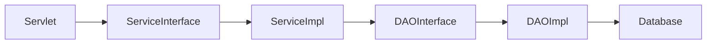

# API & Servlet Specification

This document details the endpoints (Servlets) available in the TurfSpot system and their expected parameters.

## Endpoints

### 1. User Servlet (`/user`)
Handles authentication and profile management.

| Action | Method | Parameters | Description |
| :--- | :--- | :--- | :--- |
| `register` | POST | `username`, `password`, `email` | Registers a new user. |
| `login` | POST | `username`, `password` | Authenticates a user and starts a session. |
| `logout` | GET | - | Ends the current session. |

### 2. Turf Servlet (`/turf`)
Manages turf listings.

| Action | Method | Parameters | Description |
| :--- | :--- | :--- | :--- |
| `list` | GET | - | Returns a list of all turfs. |
| `view` | GET | `id` | Returns details for a specific turf. |

### 3. Slot Servlet (`/slot`)
Handles availability checking.

| Method | Parameters | Description |
| :--- | :--- | :--- |
| GET | `turfId` | Returns all available slots for a specific turf. |

### 4. Booking Servlet (`/booking`)
Handles reservation logic.

| Action | Method | Parameters | Description |
| :--- | :--- | :--- | :--- |
| `create` | POST | `slotId` | Creates a new booking (requires login). |
| `list` | GET | - | Returns booking history for the logged-in user. |

### 5. Review Servlet (`/review`)
Handles feedback submission.

| Method | Parameters | Description |
| :--- | :--- | :--- |
| POST | `turfId`, `rating`, `comment` | Submits a review for a turf. |

## Internal API (Service Layer)
All business logic is abstracted into the `com.turfmanagement.service` package. 
Controllers should never call the DAO layer directly.

