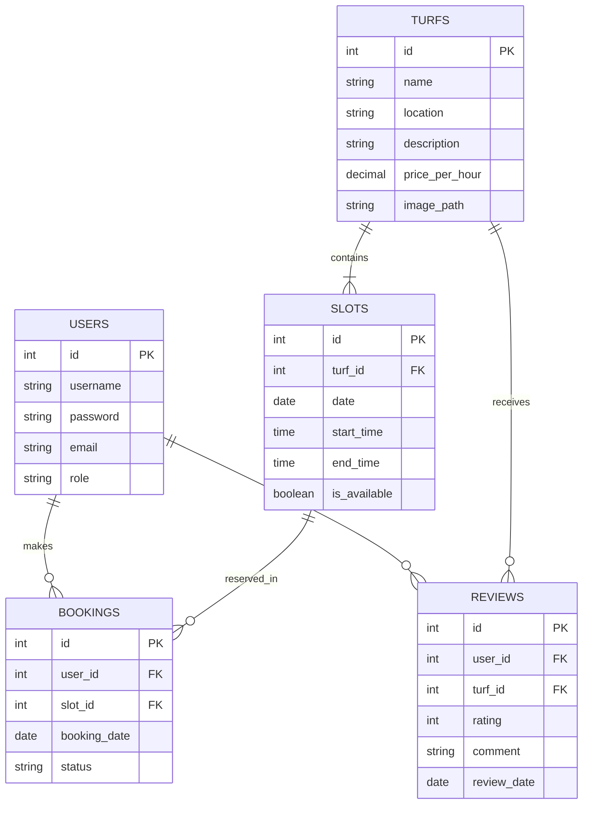

# Database Documentation

The TurfSpot system uses a MySQL relational database. The schema is optimized for data integrity and follows BCNF.

## 📊 Entity Relationship Diagram

## 📋 Table Descriptions

### `users`
Stores user credentials and roles. Passwords are encrypted using BCrypt.

### `turfs`
Details of the sports grounds available for booking.

### `slots`
Inventory of time slots for each turf. A slot is the unit of reservation.

### `bookings`
Links a user to a specific slot on a specific date.

### `reviews`
User feedback and ratings for specific turfs.
